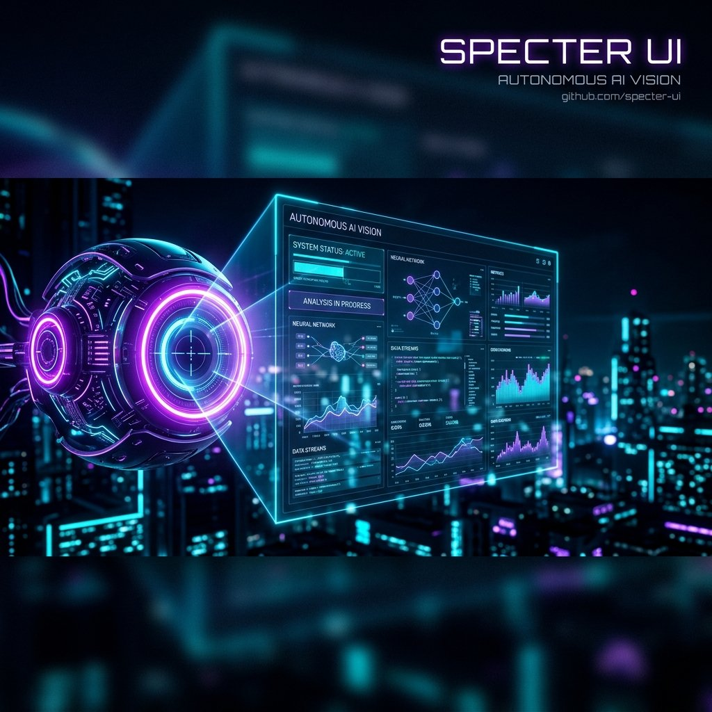
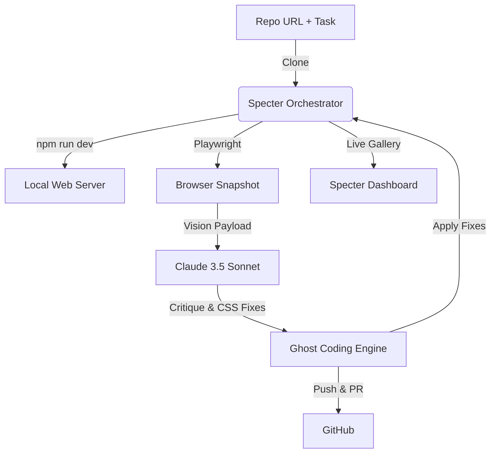

# 👁️ Specter UI



> **The autonomous visual auditor.**  
> *It doesn't just read code; it "sees" your web app and fixes the aesthetics — automatically.*

Specter UI is a multi-modal agentic swarm designed to ensure your applications look as good as they work. It uses browser automation to capture snapshots, **Claude 3.5 Sonnet** to audit the visual design, and coordinates with its sibling (the Ghost Developer) to fix UX friction and styling bugs.

---

## 🌟 Key Features

- **👁️ Spectral Vision:** Integrates Playwright to navigate local and remote web apps, capturing high-resolution snapshots of your UI state.
- **💎 Design Sensibility:** Uses Claude 3.5 Sonnet's vision capabilities to audit typography, alignment, color harmony, and overall "premium" feel.
- **⚡ Autonomous Refactoring:** Generates visual critiques and automatically creates PRs with CSS/Tailwind patches to improve the aesthetics.
- **📺 Visual Audit Gallery:** A live dashboard that shows the agent's current "view" and its visual reasoning in real-time.

---

## 📊 How it Works



---

## 🛠️ Quick Start

### 1. Prerequisites
Ensure **Playwright** and the **Claude Code CLI** are installed:
```bash
npm install -g @anthropic-ai/claude-code
pip install playwright
playwright install chromium
```

### 2. Setup
```bash
git clone https://github.com/umang-algo/Specter-UI.git
cd Specter-UI
pip install -r requirements.txt
cp .env.example .env
```

### 3. Run
Launch the visual auditor:
```bash
python3 run.py
```

---

## 🧠 Spectral Roadmap
- [ ] **Multi-device Testing**: Automatically audit for iPhone, iPad, and Desktop layouts.
- [ ] **Accessibility Audit**: Vision-based WCAG compliance checking.
- [ ] **Motion Analysis**: Capturing video/GIFs to audit animations and transitions.

---

## 🛡️ License
MIT License
